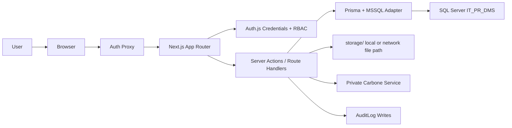
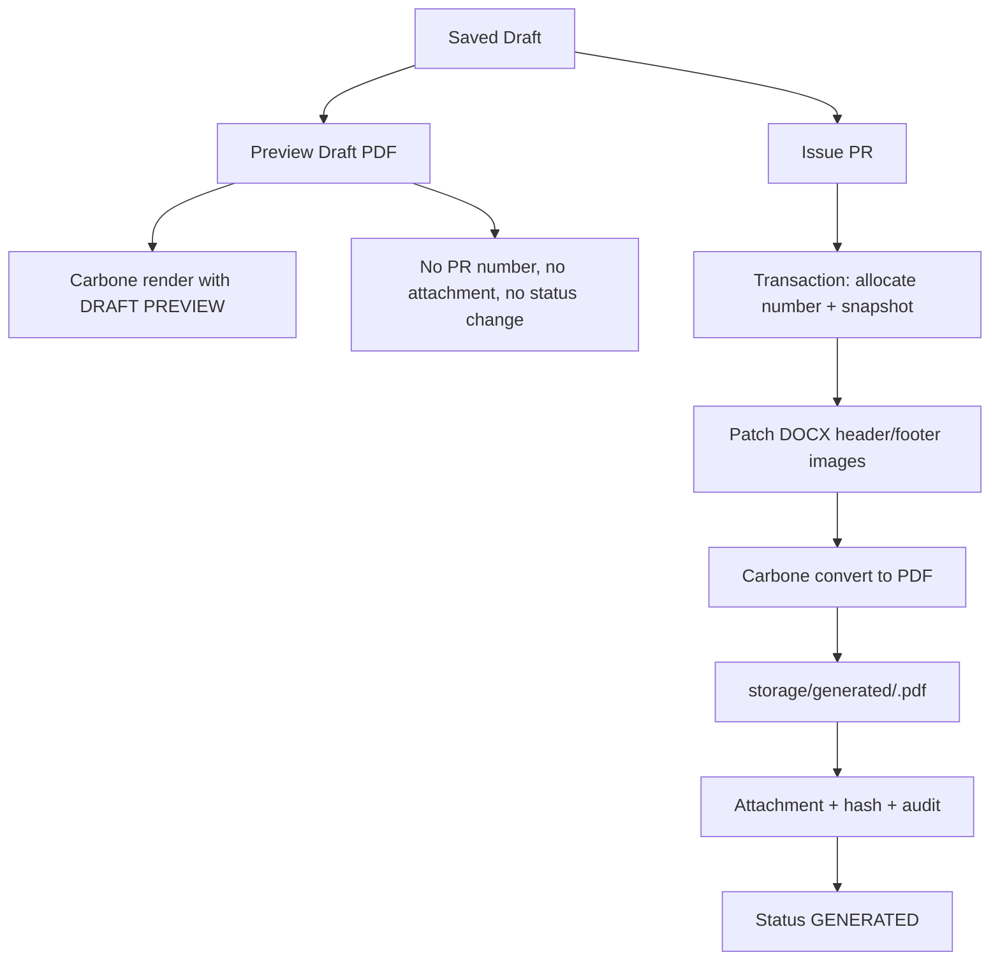

# Architecture

Last updated: 2026-06-30

## Current Runtime Shape

The application is a server-heavy Next.js App Router app. UI routes are mostly server components, while interactive form/list widgets use client components where local state is helpful.

## Folder Structure

| Path | Responsibility |
| --- | --- |
| `app/` | Route entry points, server actions, and route handlers. |
| `proxy.ts` | Auth.js JWT route gate for protected pages and route-level permission redirects. |
| `components/app/` | Authenticated shell: sidebar, topbar, breadcrumbs, module layout. |
| `components/pr/` | PR list, form, detail command center, timeline, document command UI, signed/quotation upload. |
| `components/dashboard/` | Dashboard metric and chart panels. |
| `components/ui/` | Local reusable UI primitives. |
| `scripts/` | Local operational utilities such as PDF Visual QA. |
| `lib/auth/` | Auth.js config, current user, roles, permissions, and proxy-safe route access mapping. |
| `lib/pr-draft.ts` | Draft parsing, validation, totals, create/update transactions. |
| `lib/pr-generate.ts` | PR running number, render payload, draft preview, Issue PR, DOCX image patching. |
| `lib/pr-document-control.ts` | Generated PDF/attachment delivery, mark printed, quotation upload, signed upload, cancel, reissue. |
| `lib/template-management.ts` | Template upload, tag extraction, validation, preview render QA, activation guard, archive, download. |
| `lib/company-master.ts` | Company/branch editing and header/footer asset management. |
| `lib/budget-master.ts` | Budget filter parsing, amount normalization, CRUD, active-state commands, and audit logging. |
| `lib/user-management.ts` | User admin filters, role validation, create/update, password reset, self-protection, and audit logging. |
| `lib/running-number-settings.ts` | Running-number validation, scope checks, preview formatting, create/update, and audit logging. |
| `prisma/` | SQL Server schema, migrations, seed script. |
| `storage/` | Local generated runtime files: templates, generated PDFs, signed uploads, company assets. |
| `tests/` | Vitest tests for pure helpers and command contracts. |
| `docs/` | Developer documentation. |

## Client And Server Components

Server components own data loading for protected pages. Client components are used for:

- responsive app shell interactions
- PR list filters/search
- dynamic PR item rows and live totals
- upload form UI affordances
- company master inline editing controls

Business truth stays server-side:

- authentication and permissions
- draft validation
- total calculation
- running-number allocation
- status transitions
- file path validation
- audit logging
- Carbone rendering

## Main Command Boundaries

| Boundary | Responsibilities |
| --- | --- |
| `lib/pr-draft.ts` | Parse FormData, validate master-data references, calculate totals, create/update drafts. |
| `lib/pr-generate.ts` | Build Carbone payload, format numbers/dates, split remark lines, patch DOCX images, preview draft PDF, issue official PR PDF. |
| `lib/pr-document-control.ts` | Serve controlled PDFs and attachments, mark printed, upload quotation/support files, upload signed files, cancel, reissue. |
| `lib/pdf-visual-qa.ts` | PDF structural checks, rendered-page report data, output paths, and Markdown QA formatting. |
| `lib/template-management.ts` | Validate template uploads, extract Carbone tags, render preview PDFs, activate/archive versions. |
| `lib/company-master.ts` | Edit company/branch document profile and manage header/footer image assets. |
| `lib/budget-master.ts` | Create, update, deactivate, and reactivate Budget records with admin permission and audit events. |
| `lib/user-management.ts` | Create/update users, reset passwords, enforce self-protection, and write user audit events. |
| `lib/running-number-settings.ts` | Create/update running-number settings, validate scopes, preview next numbers, and write audit events. |
| `lib/auth/current-user.ts` | Resolve session user and enforce permissions with `requirePermission()`. |
| `lib/auth/route-access.ts` | Map protected app routes to required permissions for proxy redirects. |

## Document Generation Shape

See [DOCUMENT_GENERATION.md](DOCUMENT_GENERATION.md) for the full Carbone payload and template tag contract.

## Route Data Loading

| Route | Current Data Source |
| --- | --- |
| `/dashboard` | DB-backed recent PR rows plus SQL Server PR/Budget aggregate panels. |
| `/pr` | SQL Server PR query with filters. |
| `/pr/new` | SQL Server companies, branches, departments, divisions; optional `cloneFrom` loads a source PR and maps it into initial form values. |
| `/pr/[id]` | SQL Server PR header, items, attachments, and audit timeline. |
| `/pr/[id]/edit` | SQL Server draft record only. |
| `/pr/[id]/preview-pdf` | SQL Server draft + active DOCX template + Carbone. |
| `/pr/[id]/pdf` | Stored generated attachment metadata + file storage. |
| `/pr/[id]/upload-quotation` | SQL Server PR status check + upload form for versioned quotation/supporting attachments. |
| `/pr/[id]/attachments/[attachmentId]` | Stored signed/quotation/supporting attachment metadata + file storage. |
| `/templates` | SQL Server template records and validation JSON. |
| `/templates/[id]/preview` | Stored template preview PDF generated through Carbone sample render. |
| `/masters/companies` | SQL Server company/branch document profiles and asset paths. |
| `/masters/budgets` | SQL Server Budget records with admin create/update/deactivate/reactivate flows. |
| `/settings/users` | SQL Server User records with admin create/update/password reset flows. |
| `/settings/running-numbers` | SQL Server RunningNumberSetting records with admin create/update and next-number previews. |
| `/audit-logs` | SQL Server audit records with filters, summary cards, and entity links. |
| `/audit-logs/export` | SQL Server audit records with the same filters, serialized to bounded CSV. |
| `/reports` | SQL Server PR/Budget aggregates with year/month/company/status filters and no-budget warning state. |
| `/reports/export` | Same filtered report serialized as a local XLSX workbook, including Summary warnings when budget context is missing. |

## State Rules

- `DRAFT` can be edited and previewed repeatedly.
- `Issue PR` is the point where document control begins.
- `GENERATED` has a persisted PDF, hash, template id, snapshot JSON, and audit event.
- `PRINTED` means the generated document was marked as printed.
- `SIGNED` means signed PDF or scan was uploaded as a versioned attachment.
- `QUOTATION` attachments are supporting evidence and do not change PR lifecycle status.
- `CANCELLED` preserves generated/signed records and requires a reason.
- `REISSUED` indicates a cancelled PR has already produced a replacement draft.
- `Clone as Draft` is not a status transition: `/pr/new?cloneFrom=<id>` pre-fills a new draft form, and only saved clones store `clonedFromId` on the new `DRAFT` row.
- Controlled documents should not be silently overwritten.

## Storage Rules

- All runtime files live under `storage/`.
- Storage path resolvers reject traversal outside `storage/`.
- Generated PDFs are stored under `storage/generated`.
- Signed files are stored under `storage/signed`.
- Quotation/supporting files are stored under `storage/quotations`.
- Template originals are stored under `storage/templates`.
- Template preview PDFs are stored under `storage/template-previews`.
- Company assets are stored under `storage/company-assets`.
- PDF QA artifacts are written under `output/pdf-qa`.

Production can swap the underlying folder to a network path, but the same safe relative-path metadata model should remain.
