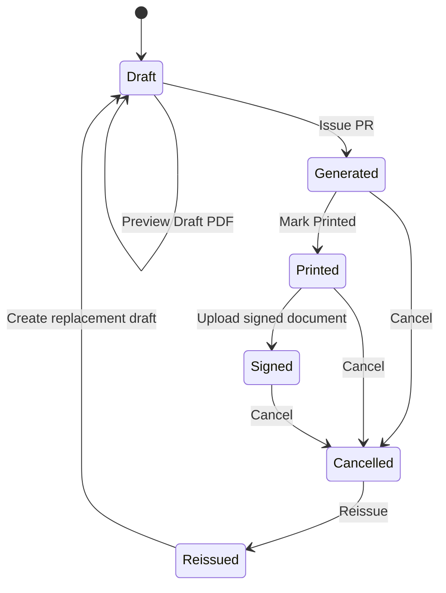

# Data Model

This is the current domain model used by the MVP backend. Names can be adjusted in future migrations, but the domain boundaries should stay intact.

## Core Entities

### User

Represents an application user.

Suggested fields:
- `id`
- `username`
- `displayName`
- `email`
- `passwordHash`
- `authProvider`
- `externalUsername`
- `externalId`
- `lastLoginAt`
- `role`
- `isActive`
- `createdAt`
- `updatedAt`

Current rules:
- `User.role` is the RBAC source of truth.
- `authProvider` is `LOCAL` or `LDAP`; unknown stored values are treated as unsafe and fail closed for password reset.
- `passwordHash` is nullable because LDAP users authenticate against AD/LDAP and never store AD passwords in SQL Server.
- Local password hashes use the local `scrypt$1$...` format used by Auth.js credentials login.
- `externalUsername` stores the AD short username such as `veerapon.l` for LDAP users.
- `externalId` stores a stable LDAP identifier such as `objectGUID`; SQL Server also has a filtered unique index for non-null external ids.
- `lastLoginAt` is updated only after successful local or LDAP login.
- Admin Settings can create local users, create LDAP allowlist users after `Verify AD User`, update profile/role/active state, and reset local passwords.
- Username is immutable after create in the admin UI.
- Password hashes are never rendered or stored in audit metadata.

### Role / Permission

Current default roles are stored directly on `User.role`:

- `ADMIN`
- `IT_ADMIN`
- `IT_USER`
- `VIEWER`

AD/LDAP Search + Bind authenticates identity, then resolves an existing SQL Server allowlist `User` row and uses `User.role` as the permission source.

Admin-only permissions currently include:
- `TEMPLATE_MANAGE`
- `MASTER_DATA_MANAGE`
- `BUDGET_MANAGE`
- `USER_MANAGE`
- `RUNNING_NUMBER_MANAGE`
- `AUDIT_VIEW`

### Company

Represents the legal entity used on the PR document.

Suggested fields:
- `id`
- `code`
- `legalName`
- `displayName`
- `taxId`
- `isActive`

### Branch

Suggested fields:
- `id`
- `companyId`
- `code`
- `name`
- `address`
- `documentRefNo`
- `documentLegalName`
- `documentTaxId`
- `documentAddress`
- `documentDisplayName`
- `documentHeaderAssetPath`
- `documentFooterAssetPath`
- `isActive`

### Department

Suggested fields:
- `id`
- `name`
- `isActive`

### Division

Suggested fields:
- `id`
- `departmentId`
- `name`
- `isActive`

### Budget

Suggested fields:
- `id`
- `year`
- `companyId`
- `branchId`
- `departmentId`
- `budgetAmount`
- `usedAmount`
- `reservedAmount`
- `isActive`

Current rules:
- `branchId` is optional. `null` means the budget applies to all branches for the company.
- The unique scope is `year + companyId + branchId + departmentId`.
- Budget Master deactivates/reactivates rows through `isActive`; it does not hard-delete budget history.
- Dashboard and Reports read active budget rows for aggregate totals.

### PurchaseRequest

Main document record.

Suggested fields:
- `id`
- `prNo`
- `refNo`
- `companyId`
- `branchId`
- `departmentId`
- `divisionId`
- `documentDate`
- `requiredDate`
- `purpose`
- `purchaseMethod`
- `remark`
- `subtotal`
- `vatRate`
- `vatAmount`
- `totalAmount`
- `status`
- `templateVersionId`
- `generatedSnapshotJson`
- `createdById`
- `createdAt`
- `updatedAt`
- `generatedAt`
- `printedAt`
- `signedAt`
- `cancelledAt`
- `reissuedFromId`
- `clonedFromId`

Current rules:
- `reissuedFromId` links replacement drafts created after cancelling a controlled PR.
- `clonedFromId` links a new user-reviewed draft to the source PR used for Clone as Draft.
- Clone as Draft is not a controlled-document correction. It copies business fields and line items into `/pr/new?cloneFrom=<id>`, but the new record is not created until Save Draft or Save & Preview.
- Cloned drafts do not copy `prNo`, generated/signed attachments, generated snapshots, status, or prior audit history.
- Saved cloned drafts start as `DRAFT` with `prNo = null` and write `Draft cloned` audit metadata.

### PurchaseRequestItem

Suggested fields:
- `id`
- `purchaseRequestId`
- `lineNo`
- `accountCode`
- `description`
- `quantity`
- `unitCost`
- `totalAmount`

### PurchaseRequestAttachment

Suggested attachment types:
- `GENERATED_PDF`
- `SIGNED_PDF`
- `SIGNED_SCAN`
- `QUOTATION`
- `OTHER`

Suggested fields:
- `id`
- `purchaseRequestId`
- `type`
- `version`
- `fileName`
- `mimeType`
- `fileSize`
- `storagePath`
- `sha256`
- `uploadedById`
- `uploadedAt`

Current rules:
- Generated PDFs are created by Issue PR and are served through `/pr/[id]/pdf`.
- Signed files and quotations/supporting files are versioned per PR and attachment type.
- `QUOTATION` attachments can be added while a PR is Draft, Generated, Printed, or Signed.
- `QUOTATION` upload does not change PR status.
- Attachment file delivery is permission guarded and storage paths must stay under `storage/`.

### DocumentTemplate

Suggested fields:
- `id`
- `name`
- `version`
- `contractName`
- `status`
- `templateType`
- `fileName`
- `storagePath`
- `validationJson`
- `createdById`
- `createdAt`
- `activatedAt`
- `archivedAt`

Current rules:
- `validationJson` stores tag validation results.
- `validationJson.preview` stores the latest template preview status, rendered timestamp, file name, storage path, content type, SHA-256 hash, or failure error.
- Preview metadata is stored in JSON instead of a separate table for the current MVP phase.

### RunningNumberSetting

Suggested fields:
- `id`
- `documentType`
- `prefix`
- `yearFormat`
- `monthFormat`
- `padding`
- `currentValue`
- `scopeCompanyId`
- `scopeBranchId`
- `updatedAt`

Current rules:
- `documentType + scopeCompanyId + scopeBranchId` is unique.
- Empty scope means global.
- Document type and scope are fixed after create in the admin UI.
- Prefix, year format, month format, padding, and current value are editable.
- Running Number Settings preview uses the same formatter used by official PR Issue.

### AuditLog

Suggested fields:
- `id`
- `entityType`
- `entityId`
- `action`
- `actorId`
- `metadataJson`
- `ipAddress`
- `userAgent`
- `createdAt`

## PR Statuses

Current UI status type:

```ts
type PRStatus = "Draft" | "Generated" | "Printed" | "Signed" | "Cancelled" | "Reissued";
```

Recommended lifecycle:



Rules:
- Only `Draft` should be freely editable and previewable.
- Draft Preview must not allocate a PR number, mutate status, persist attachment metadata, or write official generation audit.
- `Issue PR` is the controlled-document boundary.
- `Generated` should have a stored data snapshot.
- `Printed` should be treated as a controlled document.
- `Signed` must keep all uploaded signed versions.
- `Cancelled` and `Reissued` must preserve lineage and audit history.

## Calculation Rules

Backend should calculate and persist:

- Line total: `quantity * unitCost`
- Subtotal: sum of line totals
- VAT amount: `subtotal * vatRate`
- Total: `subtotal + vatAmount`
- Remaining budget: `budgetAmount - usedAmount - reservedAmount`

Budget tracking is soft-controlled. PR actions are not blocked by missing or insufficient Budget rows; matching active budgets are adjusted during the PR lifecycle and audit metadata records `MATCHED`, `OVER_BUDGET`, or `MISSING`.

The frontend can display and preview calculations, but backend must be authoritative.

## Template And Render Notes

- `DocumentTemplate.templateType` is `DOCX` or `XLSX`.
- Uniqueness is `name + version + templateType`.
- Official PR PDF generation uses active `PR_STANDARD DOCX`.
- Template management can validate both DOCX and XLSX by extracting tags from Office XML.
- DOCX template preview PDFs are stored under `storage/template-previews` and are not `PurchaseRequestAttachment` rows.
- `PR_STANDARD DOCX` activation requires passed tag validation and passed preview render.
- XLSX activation remains validation-only.
- Branch header/footer images are stored as branch asset paths and patched into the DOCX during rendering.
- Rendered official PDFs are represented by `PurchaseRequestAttachment` with type `GENERATED_PDF`.
- Quotation/supporting uploads are represented by `PurchaseRequestAttachment` with type `QUOTATION`.
- Draft preview PDFs are transient and do not create attachment rows.
