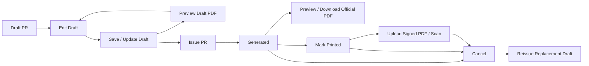

# Document Generation

Last updated: 2026-07-02

This document is the current source of truth for PR Word templates, Carbone payload fields, PDF preview, and official Issue PR behavior.

## Current Flow



## Draft Preview

Draft preview is for iterative review before document control begins.

- Route: `/pr/[id]/preview-pdf`
- Download route: `/pr/[id]/preview-pdf?download=1`
- Allowed status: `DRAFT`
- Permission: `PR_UPDATE_DRAFT`
- Template: active `PR_STANDARD` `DOCX`
- PR number shown in the rendered payload: `DRAFT PREVIEW`
- File name pattern: `PR_DRAFT_PREVIEW_<draftId>.pdf`
- Storage behavior: not persisted as an attachment
- Running number behavior: no number allocation
- Audit behavior: no audit event
- Snapshot behavior: no `generatedSnapshotJson` update
- Status behavior: remains `DRAFT`

Preview reads the latest saved draft data from SQL Server. If a user edits fields in the browser but does not save/update the draft, preview will not include those unsaved changes.

## Official Issue PR

Issue PR is the controlled document action.

- UI label: `Issue PR`
- Server command: `generatePurchaseRequestPdf`
- Allowed status: `DRAFT`
- Permission: `PR_GENERATE`
- Template: active `PR_STANDARD` `DOCX`
- Output path: `storage/generated/<prNo>.pdf`
- Attachment type: `GENERATED_PDF`
- Status after success: `GENERATED`
- Audit action: `Generated PDF`

Issue PR:
- allocates the next `ITPR_YYMMNNN` number inside a transaction
- checks existing PR numbers for the same prefix before selecting the next sequence
- stores `generatedSnapshotJson`
- patches branch header/footer images into the DOCX template
- sends the template and normalized payload to Carbone
- writes the generated PDF to local storage
- stores attachment metadata, file size, MIME type, SHA-256 hash, and template id

After Issue PR, the document should be treated as controlled. Use Cancel/Reissue for changes after issuance.

## PDF Visual QA

Use PDF Visual QA when a generated PR PDF or template preview PDF needs evidence before UAT.

```bash
npm run pdf:qa -- --input storage/generated/ITPR_2606008.pdf --expected-pages 1
```

The command writes:

- `output/pdf-qa/<pdf-name>/report.json`
- `output/pdf-qa/<pdf-name>/report.md`
- `output/pdf-qa/<pdf-name>/page-1.png`, `page-2.png`, and so on when Poppler rendering is available

The automated report checks PDF signature, EOF marker, byte size, estimated page count, expected page count, rendered page count, and rendered PNG file sizes. The Markdown report also includes the human visual checklist for header/footer, table alignment, monetary formatting, remark overflow, Thai/English text clipping, and unexpected extra pages.

Latest smoke check:

- Input: `storage/generated/ITPR_2606008.pdf`
- Result: `PASS`
- Output: `output/pdf-qa/ITPR_2606008/report.md`
- Rendered image: `output/pdf-qa/ITPR_2606008/page-1.png`

## Template Files

Template management supports:

- `.docx` files as `DOCX`
- `.xlsx` files as `XLSX`
- 10 MB maximum file size
- upload to `storage/templates`
- original file download through `/templates/[id]/file`
- Carbone tag extraction from Office XML
- validation against the PR payload contract
- DOCX preview render QA before activation
- activation by `name + templateType`
- archiving draft/active versions

Official PR PDF generation uses only the active `PR_STANDARD` `DOCX`.

## Template Preview Before Activation

Template Preview is for admin QA before a DOCX template becomes active.

- Route: `/templates/[id]/preview`
- Download route: `/templates/[id]/preview?download=1`
- Permission: `TEMPLATE_MANAGE`
- Supported preview type: `DOCX` to PDF
- Sample PR number shown in the rendered payload: `TEMPLATE PREVIEW`
- Output path: `storage/template-previews/<template-name>_<version>_<type>.pdf`
- Metadata location: `DocumentTemplate.validationJson.preview`
- Audit actions: `Template preview rendered` or `Template preview failed`

Admins should run `Validate`, then `Preview Template`, then `Activate`. `PR_STANDARD DOCX` activation is blocked until validation has no missing required tags and preview status is `PASSED`.

XLSX templates can still be uploaded, validated, activated, archived, and downloaded, but they do not have PDF preview enforcement because official PR PDF generation currently uses only DOCX.

## Header And Footer Images

Company/branch document images are stored on `Branch`:

- `documentHeaderAssetPath`
- `documentFooterAssetPath`

Files are uploaded from `/masters/companies` and stored under:

- `storage/company-assets/<branchId>/header.png`
- `storage/company-assets/<branchId>/footer.png`

At render time the app:

1. Reads the branch image files from safe storage paths.
2. Builds Base64 Data URI fields for Carbone payload compatibility.
3. Patches the DOCX package directly with `applyBranchImagesToDocxTemplate`.
4. Replaces images whose alt text contains `{d.companyHeaderImage}` or `{d.companyFooterImage}`.

This direct DOCX patching avoids relying only on image Data URI rendering behavior.

## Monetary Formatting

Use formatted fields in document templates when the output cell must show comma separators and exactly two decimals.

| Field | Example |
| --- | --- |
| `d.items[i].unitCostFormatted` | `78,500.00` |
| `d.items[i].totalAmountFormatted` | `78,500.00` |
| `d.subtotalFormatted` | `108,650.50` |
| `d.vatAmountFormatted` | `7,605.54` |
| `d.totalAmountFormatted` | `116,256.04` |
| `d.totalAmountText` | `THB 116,256.04` |

Raw numeric fields are still available for calculations or templates that use Carbone numeric formatters:

- `d.items[i].unitCost`
- `d.items[i].totalAmount`
- `d.subtotal`
- `d.vatAmount`
- `d.totalAmount`

For the current PR Word template, prefer the formatted fields above.

## Remark Lines

The current Word template has two ruled remark rows. Use:

- `d.remarkLine1`
- `d.remarkLine2`

The app normalizes line breaks and spaces, splits at a preferred word boundary, and keeps each line within the fixed template row length. Very long text is clipped with `...` to avoid spilling into a second page.

Avoid putting `d.remark` directly into the ruled cells unless the template layout is changed to support automatic row growth.

The active `PR_STANDARD_V1.docx` template keeps the `remarkLine1` and `remarkLine2` tag runs on the same font family and size as the item-table text so mixed Thai/English remark output renders consistently in PDF.

## Checkbox Marks

The fixed PR template should use precomputed mark fields instead of complex Carbone condition chains in checkbox cells.

Purpose tags:

- `d.purposeNewMark`
- `d.purposeReplacementMark`
- `d.purposeRepairMark`
- `d.purposeRenewalMark`

Purchase method tags:

- `d.purchaseByProcurementMark`
- `d.purchaseSelfMark`

The selected option renders `X`; unselected options render blank.

## Item Loop

Use `d.items[i]` tags only inside the item table.

Common item fields:

- `d.items[i].lineNo`
- `d.items[i].itemNo`
- `d.items[i].rowType`
- `d.items[i].isHeading`
- `d.items[i].accountCode`
- `d.items[i].description`
- `d.items[i].quantity`
- `d.items[i].unitCostFormatted`
- `d.items[i].totalAmountFormatted`
- `d.items[i+1]`

`accountCode` can be blank. The create PR form intentionally allows Acct to be empty.

PR item rows support two row types:

- `ITEM`: a priced item/service row. It requires Description, Qty, and Unit Cost, is included in subtotal/VAT/total calculations, and receives the next visible item number.
- `HEADING`: a non-priced grouping row. It requires only Description, stores zero numeric values in SQL Server, is excluded from totals, and renders blank `lineNo`, `quantity`, `unitCostFormatted`, and `totalAmountFormatted` values.

The current `PR_STANDARD` Word template can keep using `d.items[i].lineNo` for the visible number. Heading rows intentionally render that value blank, so later item rows keep continuous numbering such as `1, 2, 3` even when headings are inserted between them. `d.items[i].itemNo` is available as the same visible number for newer templates.

## Required Tags

Template activation currently requires these base tags:

- `d.prNo`
- `d.documentDate`
- `d.companyName`
- `d.branchName`
- `d.department`
- `d.purpose`
- `d.purchaseMethod`
- `d.totalAmount`
- `d.items[i].description`
- `d.items[i].quantity`
- `d.items[i].unitCost`
- `d.items[i].totalAmount`

Known optional tags include branch document profile fields, image fields, formatted amounts, remark split lines, checkbox marks, and item line/account fields.

## Current Improvement Backlog

- Add automated pixel/baseline comparison on top of generated PDF page PNGs.
- Add user-facing warning when branch header/footer images are missing.
